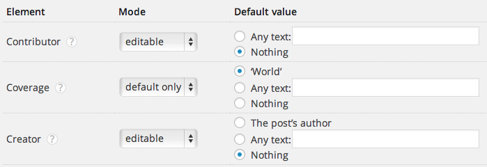
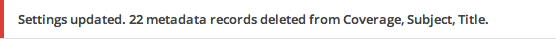

dc-meta-tags
============
WordPress plugin for adding Dublin Core meta tags to wp_head on pages, posts & custom post types. Outputs XHTML, HTML4 or HTML5 syntax.

* *Contributors:* Joost Kiens, Júlio Reis
* *Tags:* Dublin Core, meta tags, metadata, RDF
* *Requires at least:* 3.3.0
* *Tested up to:* 3.8.1
* *Stable tag:* 0.4.1
* *License:* GPLv3
* *License URI:* [http://www.gnu.org/licenses/gpl-3.0.html](http://www.gnu.org/licenses/gpl-3.0.html) or see the included `LICENSE.txt` and `LICENSE.md`

Description
---------------------------------

This WordPress plugin adds [Dublin Core Metadata Element Set v1.1](http://dublincore.org/documents/dces/) meta tags to the head of your site. Dublin Core elements are a subset of RDF and help with the discoverability of your site.

### Supported elements

The complete Dublin Core Metadata Element Set v1.1 is supported.

### Settings

On the settings page (_Settings > DC Meta Tags_) you can configure the meta tags:

* Select which elements should be included with a default value only, and which should allow editing in the post’s meta box: the _field mode_
* Select the type of default value you want, and enter a default text value, for any fields
* Select on which post types the meta tags should appear
* Indicate if you want HTML4, XHTML, or HTML5 syntax

_Field modes_

### Meta box on posts

On the add/edit post screens a meta box is available to override the default meta values.

All the elements in the meta box are multivalue, e.g. you may indicate more than one language, more than one description etc.

### Only for documents

Since the Dublin Core Metadata Element Set v1.1 describes documents, it is only added to attachments, pages, posts and custom post types. No metadata is added to non-editable pages like the home page, archives, etc.

Installation
---------------------------------

1. Upload `dc-meta-tags` folder to the `/wp-content/plugins/` directory
1. Activate the plugin through the ‘Plugins’ menu in WordPress
1. Go to _Settings > DC Meta Tags_ to configure it if necessary

### Updates

This plugin works with `github-updater`: turn it on to get automatic update notices when a new version is published on GitHub.

### Translations

This plugin’s translations are managed via Transifex. To help out, please go to [https://www.transifex.com/projects/p/dc-meta-tags/](https://www.transifex.com/projects/p/dc-meta-tags/). Thank you!

Frequently Asked Questions
---------------------------------

#### How is the metadata generated?

The metadata is automatically generated based on the post title, author, excerpt, categories, tags, etc. 

#### Can I override the generated metadata for specific posts?

Yes, a meta box is available on the add/edit post screens.

#### Where is the meta box? I don't see it.

Go to ‘Screen options’ and make sure ‘Dublin Core Metadata’ is checked.

#### I don't like the unnessary closing slash in the HTML5 output. Can I remove it?

Add `define ('DCM_HTML5_CLOSING_SLASH', false);` to your `wp-config.php` and you’re good to go.

#### What happens to data that’s no longer needed?

It’s deleted. When a field goes from ‘Editable’ to ‘Default only’, the values entered on it are no longer needed, and are therefore removed. Be careful!

Likewise, if the plugin is removed, all the metadata is removed from the database.

Changelog
---------------------------------

See [CHANGES.md](CHANGES.md)
